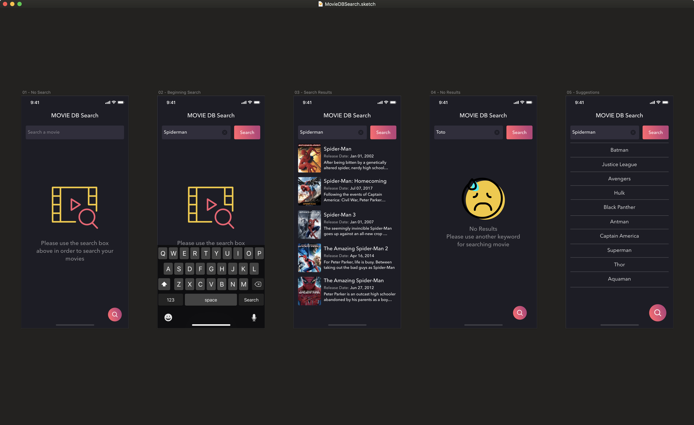

# Movie DB Search #
iOS App for searching movies

 

## How to run the project ##

1.Download the project folder or clone it 
2. Go to the project folder and install all the dependencies through [Carthage](https://github.com/Carthage/Carthage)
3. Run *carthage update --no-use-binaries --platform iOS* in order to install all the dependencies 
4. Build, Run & Enjoy 

## Libraries Used ##
- [RXSwift](https://github.com/ReactiveX/RxSwift) for reactive programming
- [DZNEmptyDataSet](https://github.com/dzenbot/DZNEmptyDataSet) for showing empty states
- [Swinject](https://github.com/Swinject/Swinject) for dependency injection
- [Nuke](https://github.com/kean/Nuke) for preheating images 
- [SwiftyJSON](https://github.com/SwiftyJSON/SwiftyJSON) for dealing with JSON easily
- [MBProgressHUD](https://github.com/jdg/MBProgressHUD) for showing HUD when loading web requests

## Tools Used ##
- [Xcode 9.4](https://developer.apple.com/xcode/) for development 
- [Reveal](https://revealapp.com) for View Debugging
- [Asset Catalog Creator](https://itunes.apple.com/us/app/asset-catalog-creator-pro/id809625456?mt=12) for icon generation
